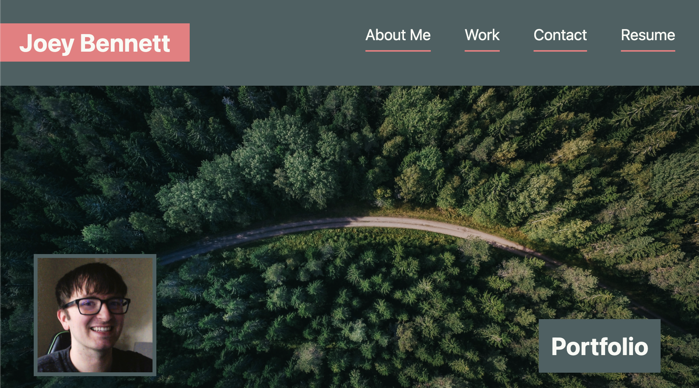
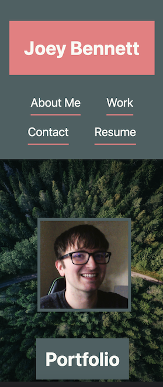

# **Joey Bennett's Web Portfolio** 

---

## **Introduction**
**Welcome to my web portfolio!**

This is my flat portfolio, presenting my experience and projects in web development with simple flat UI elements and a minimalist layout.

You can visit the page [here](https://coderbennett.github.io/portfolio-flat/).

## **Header Styling**

As seen above, I went with a standard horizontal navbar. I chose a title image of a forest trail because I love nature and hiking with my partner Jason and dog Flora.

### **Resume Attached**
If you would like to view my resume you can find it attached to this site by navigating to the <code>Resume</code> link in the navbar. This will pull up the .pdf file I am currently using.

## **Responsive Design**

Every aspect of this portfolio is responsive. The above image shows the header as it would appear on a very small mobile phone.

## **Projects Section**

---

Currently my projects section is a work in progress as I am a student, however once I have some deployed projects I will begin to fill that section on my website and this portion of the README as well.

## **Licensing**

---

My portfolio is available under the MIT license. For licensing details see [LICENSE](LICENSE.txt) document.